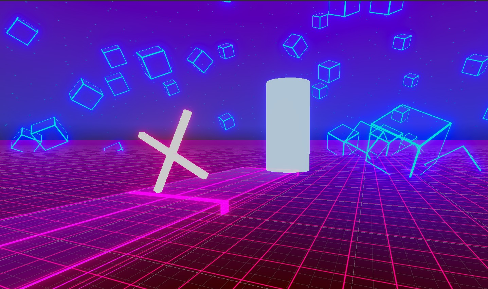
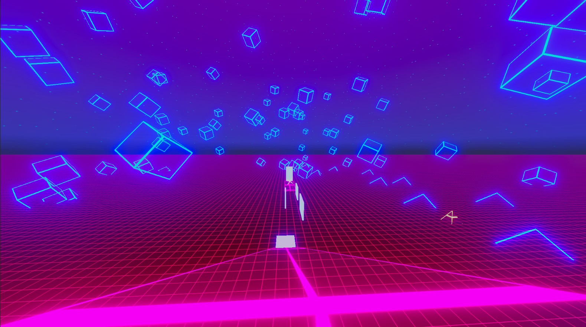
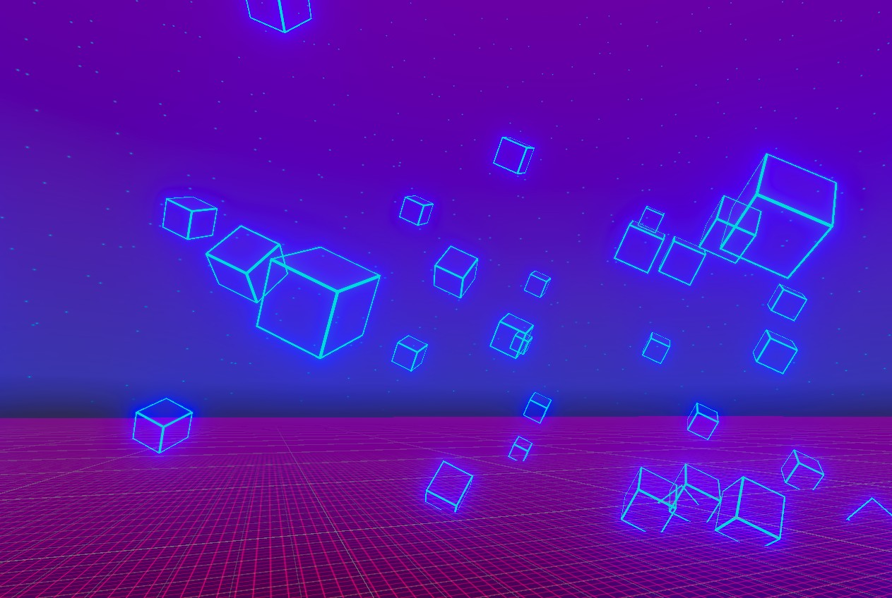

# 🏃 Parkour Game

> A fast-paced 3D parkour game built with **Unity**, featuring fluid movement mechanics, wall running, sliding, double jumping, and a cyberpunk-inspired environment.

<p align="center">


</p>

---

## 🎥 Gameplay

> Gameplay GIF coming soon.

<!-- Replace with your gameplay GIF -->

<!--
<p align="center">
  
</p>
-->

---

## 📸 Screenshots

<p align="center">
  
  
  
</p>

---

## ✨ Features

* 🏃 Smooth First Person Controller
* 🧗 Wall Running
* 🛝 Sliding
* 🚀 Double Jump
* 📦 Jump Pads
* 🏗️ Moving Platforms
* 🎮 Unity Input System
* 🌆 Cyberpunk / Retrowave Environment
* 💡 Dynamic Lighting
* 🔊 Ambient Sound Effects

---

## 🎮 Controls

| Key          | Action             |
| ------------ | ------------------ |
| `W A S D`    | Move               |
| `Mouse`      | Look Around        |
| `Space`      | Jump / Double Jump |
| `Left Shift` | Sprint / Slide     |
| `E`          | Interact           |

---

## 🚀 Getting Started

### Requirements

* Unity **2022.3 LTS** or newer
* Universal Render Pipeline (URP)
* Git LFS *(recommended)*

### Clone the Repository

```bash
git clone https://github.com/amirrezamahdav12/ParkourGame.git
```

### Open the Project

1. Open **Unity Hub**
2. Add the cloned project
3. Open the project with **Unity 2022.3 LTS**
4. Open the main scene from:

```text
Assets/Scenes/
```

5. Press **Play**

---

## 🏗 Architecture

```text
Player
├── Input System
├── Movement Controller
│   ├── Walk
│   ├── Sprint
│   ├── Jump
│   ├── Double Jump
│   ├── Slide
│   └── Wall Run
│
├── Camera Controller
└── Interaction System
```

The movement system is designed to be modular, allowing new mechanics such as climbing, vaulting, or grappling hooks to be added easily.

---

## 📂 Project Structure

```text
ParkourGame
│
├── Assets
│   ├── Art
│   ├── Audio
│   ├── Materials
│   ├── Prefabs
│   ├── Scenes
│   ├── Scripts
│   │   ├── Movement
│   │   ├── Environment
│   │   ├── Managers
│   │   └── UI
│   └── InputSystem_Actions.inputactions
│
├── Packages
├── ProjectSettings
└── README.md
```

---

## 📦 Dependencies

* DOTween
* Unity Input System
* Retrowave Skies Lite
* Scalable Grid Prototype Materials

---

## 🗺 Roadmap

* [x] Basic Movement
* [x] Sprint
* [x] Sliding
* [x] Wall Running
* [x] Double Jump
* [x] Jump Pads
* [ ] Checkpoint System
* [ ] Main Menu
* [ ] Settings Menu
* [ ] Save System
* [ ] Multiplayer

---

## ⚠ Known Issues

* Wall running may lose momentum on sharp corners.
* Audio balancing is still being improved.
* Some assets are temporary placeholders.

---

## 🤝 Contributing

Contributions are welcome.

1. Fork the repository.
2. Create a feature branch.
3. Commit your changes.
4. Push the branch.
5. Open a Pull Request.

---

## 🙏 Credits

Thanks to the creators of the assets and tools used in this project.

* DOTween
* Unity Technologies
* Retrowave Skies Lite
* Scalable Grid Prototype Materials

---

## 📄 License

This project is licensed under the **MIT License**.

See the `LICENSE` file for more information.

---

## 👨‍💻 Author

**Amirreza Mahdavi**

GitHub: https://github.com/amirrezamahdav12

---

<div align="center">

### ⭐ If you like this project, consider giving it a Star!

</div>
